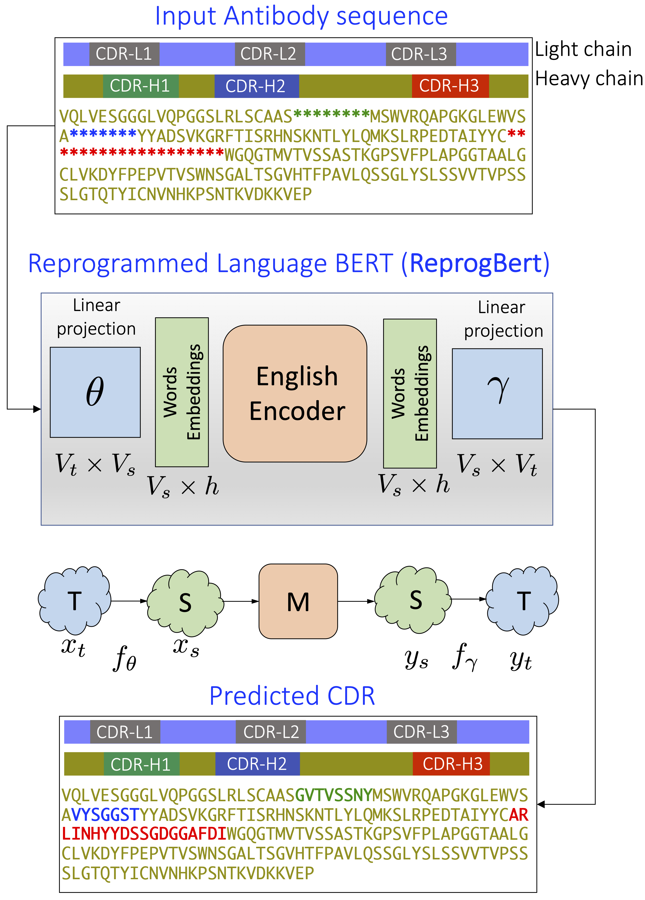
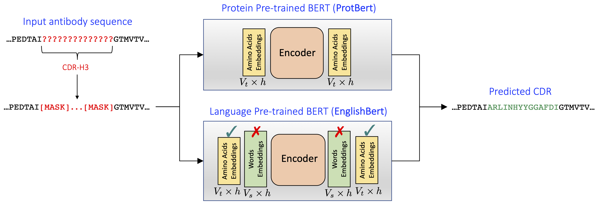

<div align="center">    
 
# Reprogramming Pretrained Language Models for Antibody Sequence Infilling

[](https://arxiv.org/abs/2210.07144)
[](https://icml.cc/Conferences/2023)

</div>

## Description   
We leverage Model Reprogramming to repurpose a pretrained English language model, we call it ReprogBert, for designing diverse and structurally consistent antibody sequences. 

## ReprogBert
<p align="center">
  
</p>
Overview of the proposed Protein Sequence Infilling using Model Reprogramming. Given a heavy chain of an antibody, the goal is to design three Complementarity-Determining Regions (CDR-H1, CDR-H2, CDR-H3), shown in green, blue and red colors, using information from the rest of the protein. 
The infilling problem is formulated similar to the masked-language modeling task, where the missing amino acids are marked with a token MASK and the model generates tokens to infill them.
In ReprogBert the English language BERT remains unchanged and frozen (source domain), and we introduce additional amino acid embeddings (target domain) together with the linear matrices $$\theta \in \mathbb{R}^{|V_t| \times |V_s|}$$ and $$\gamma \in \mathbb{R}^{|V_s| \times |V_t|}$$ to project from one domain to another.
During CDR infilling training, only the projection matrices and protein embeddings are fine-tuned, the language model remains unmodified. 

## ProtBert and EnglishBert
Aditionally, we included two simple baselines to compare against ReprogBert.
<p align="center">
  
</p>

The top diagram shows ProtBert, the BERT model that has been pretrained on the protein sequences and therefore can be applied to the protein infilling task as is
(the entire model is still fine-tuned on the downstream infilling task). 
The bottom diagram shows traditional English language BERT model EnglishBert, whose incompatible word embeddings 
($$V_s \times h$$, $$V_s$$ is the number of language tokens, $$h$$ - latent model dimension) are swapped with the trainable amino acid embeddings 
($$V_t \times h$$, $$V_t$$ is the number of amino acid tokens). The full model is then fine-tuned on the infilling dataset.

## Environment
Our code requires the following packages:
- datasets==2.1.0
- numpy==1.22.3
- pytorch-lightning==1.9.0
- torch==1.11.0
- transformers==4.30.2
  

## Data 

We used the data from https://github.com/wengong-jin/RefineGNN/tree/main/data . In particular, the current code uses Structural Antibody Database (SAbDab) derived from https://opig.stats.ox.ac.uk/webapps/sabdab-sabpred/sabdab


## Training
The scripts to train all three models are provided in the `script` directory

```bash
# naviagate to scripts directory
cd scripts

# train ReprogBert to infill CDR3 
bash trainReprog_cdr3.sh

# train EnglishBert to infill CDR3 
bash trainBase_cdr3.sh

# train ProtBert to infill CDR3 
bash trainProt_cdr3.sh
```

### Training Results
The code checkpoints 3 top-performing models based on validation recovery rate (AAR). Results can be visualized in Tensorboard
```bash
tensorboard --logdir output
```

## Testing
The models are tested against three metrics: amino acid recovery (AAR), amino acid diversity (DIV), and perplexity (PPL) - it
is measured by a third-party pretrained ProGen model https://github.com/salesforce/progen/tree/main/progen2 (in our experiments we used their `progen2-base` model)

```bash
# naviagate to scripts directory
cd scripts

# test ReprogBert to infill CDR3 
bash testReprog_cdr3.sh

# test EnglishBert to infill CDR3 
bash testBase_cdr3.sh

# test ProtBert to infill CDR3 
bash testProt_cdr3.sh
```

To run the testing, please provide the desired model checkpoint, for example:
```
--checkpoint output/reprog_cdr3/checkpoints/<checkpoint_file>.ckpt
```

To run the perplexity estimation, please point to the location of ProGen2 checked out repo (with already downloaded model checkpoint): 
```
--progen_dir /path/to/progen/progen2
```

### Testing Results
The test results will be displayed in terminal and can also be visualized in Tensorboard.

## Inference
The code can also perform inference on a single antibody sequence, where the CDR region is masked with ```*``` symbol
```bash
# naviagate to scripts directory
cd scripts

# run inference on a single protein sequence 
bash inference.sh
```
Main parameters for the inference script are:
```
--single_input ...SCAAS********MGWFRQAPGKE...  
--checkpoint output/reprog_cdr3/checkpoints/<checkpoint_file>.ckpt
```

### Inference Results
The result of running model on a single input sequence is a set of 100 sampled antibody sequences 
(identical to the input sequence everywhere except for the CDR region marked with ```*```). The results are saved in FASTA file ```inference_smpl.fasta```.
 

## Citation   
```
@inproceedings{reprog2023,
  title={Reprogramming Pretrained Language Models for Antibody Sequence Infilling},
  author={Melnyk, Igor and Chenthamarakshan, Vijil and Chen, Pin-Yu and Das, Payel and Dhurandhar, Amit and Padhi, Inkit and Das, Devleena},
  booktitle={Proceedings of the 2023 International Conference on Machine Learning (ICML)},
  year={2023}
}
```  